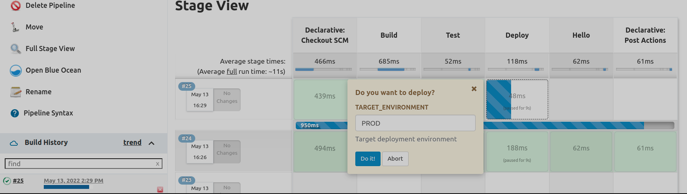

# Using Declarative Jenkins Pipelines

These are my notes for the course

1. Using Declarative Jenkins Pipelines, by Elton Stoneman, pluralsight


The workflow plugin is the pipeline plugin.
Jenkins has environment variables that run as part of any job, for example <code>BUILD_NUMBER</code>. We can always access them in our pipeline scripts.

BlueOcean is an alternative Jenkins UI specifically designed for pipeline jobs.
The environment block, at the beginning or the end of the Jenkins file, defines environment variables for that Jenkins file that can be used on any step of any stage, eg:
```groovy
pipeline {
  agent any
  
  // environment variables at the pipeline level.
  // Any step will be able to read these values
  environment {
        NAME='Pepe'
        VERSION = '1'
  }
  
  stages {
    stage('stage1') {
      steps {
        
        // Variables inside a single quoted string don't get expanded eg
        echo 'This is the $BUILD_NUMBER of version $VERSION'
        // In BlueOcean, insert the echo command through a Shell Script step
        echo "This is the $BUILD_NUMBER of version $VERSION"
        
        sh '''
          echo "Using a multi-line shell step"
          chmod +x test.sh
          ./test.sh
        '''
        
      }
    }
  }
}
```
```bash
#!/bin/sh
echo "Inside the script, $NAME is running version $VERSION"
```
Environment variables in the <code>environment{...}</code> block are visible in scripts called from the pipeline.

Here we are in a simple pipeline project configured to take a Jenkins file from a git repo through a checkout. The repo will also contain the the bash script to be run. The checkout of the repo is done automatically.


## Pipeline structure
We'll typically have build, test and publish stages. Stages can define the agent that will run it, as well as environment variables scoped to it. Inside a stage, put the <code>steps{...}</code> block with "steps", such as <code>echo</code> and <code>sh</code>, which are the most common steps.

Jenkins uses groovy as the engine for pipeline jobs. In groovy single quoted strings are literals. Only double quoted strings can use variable interpolation to inject the value of variables. So for the <code>echo</code> step we have:
```groovy
echo 'This is a $VARIABLE'  // This is a $VARIABLE
echo "This is a $VARIABLE"  // This is a demo     MEMORIZE
echo "This is a ${VARIABLE}"// This is a demo     MEMORIZE 
```
Something similar happens with the shell step <code>sh</code>. In this example, we want to interpolate variables which are inside strings which are inside the multiline sh step.
```groovy
sh "echo This is a $VARIABLE"  // this works ok
sh 'echo This is a $VARIABLE'  // this also works ok
sh '''
  echo "This is a $VARIABLE"
  echo "This is a ${VARIABLE}"
'''
sh """
  echo 'This is a $VARIABLE'
  echo 'This is a ${VARIABLE}'    // this is environment variable
  echo 'This is a ${env.VARIABLE}'  // this is Groovy variable !!!
"""
```
All these will send "This is a demo" to the standard output, ie. the value of VARIABLE will be substituted.
Notice the difference between "environment variables" and Groovy variables.
But I need to understand what the <code>sh</code> step does.

Blocks agent and environment can be at the pipeline level or a a stage level. In at the stage level, will be limited to that stage.
```groovy
pipeline {
    agent any
    environment {
        RELEASE='20.04'
    }
    stages {
        stage('Build') {
            agent any
            environment {
                LOG_LEVEL='INFO'
            }
            steps {
                echo "Building release ${RELEASE} with log level ${LOG_LEVEL}..."
            }
        }
        stage('Test') {
            steps {
                echo "This is stage: $STAGE_NAME"
                echo "Testing. I can see release ${RELEASE}, but not log level ${LOG_LEVEL}"
            }
        }
    }
}
```
Notice that the environment variables are accessed without the <code>env.</code>. Notice also that inside a given stage, the name of the stage can be accessed through the environment variable <code>STAGE_NAME</code>.

## Interactive pipeline
We ask for user input in a pipeline with the <code>input</code> step. With it, we pause the build and wait for some sort of user confirmation.

```groovy
pipeline {
    agent any
    environment {
        RELEASE='20.04'
    }
    stages {
        stage('Build') {
            agent any
            environment {
                LOG_LEVEL='INFO'
            }
            steps {
                echo "Building release ${RELEASE} with log level ${LOG_LEVEL}..."
            }
        }
        stage('Test') {
            steps {
                echo "Testing release ${RELEASE}..."
            }
        }
        stage('Deploy') {
            input {
                message 'Do you want to deploy??'
                ok 'Do it!'
                parameters {
                    string(name: 'TARGET_ENVIRONMENT', defaultValue: 'PROD', description: 'Target deployment environment')
                }
            }
            steps {
                echo "Deploying release ${RELEASE} to environment ${TARGET_ENVIRONMENT}"
            }
        }
        stage ('Hello') {
            steps {
              echo "This was the release $RELEASE"
              // echo "The target environment is: " + "$TARGET_ENVIRONMENT" // Error. Variable TARGET_ENVIRONMENT will not be visible here
            }
        }       
    }
    post {
        always {
             echo 'Prints whether deploy happened or not, success or failure'
        }
    }
}
```
Notice how what the user will write in the dialog will be captured in the variable <code>TARGET_ENVIRONMENT</code>, which we then use in the steps block of the same stage. This variable will not be visible in other stages. Notice also that in this case we don't assign what the input block returns to any variable.

If we click in Abort, the steps block of the stage with the input block will not be executed, and the whole pipeline will be "Aborted". The rest of the stages it may have will be skipped. However, the post step will still be run, so we can put on it any notification or clean up job. In the example, we run the post block <code>always</code>, ie. <u>whatever</u> the outcome of the pipeline is (FAILURE, SUCCESS etc). In the post bloc we could have a clean up step/stage? which always run, and a notification step/stage ? that only runs if the build fails.



A pipeline is only the structure for modeling our build workflow. For the actual mechanics of the build, we'll still need to use our common build tools, such as Maven, either through shell steps or through plugins. 

Other than echo and sh, other common steps are retry and timeout. Everything else come from plugins. Plugins that are pipeline compatible are steps that we can use in our stages, such as junit, unzip, kubernatesDeploy etc. <b>Plugins</b> in Jenkins will give a myriad of possibilities, in the same fashion of Ansible plugins. See course Using and Managing Jenkins Plugins, in pluralsight.


## Running stages in parallel
We can nest stages inside another stage and run them in parallel, potentially on different agent, which is a big performance boost. These nested stages will need to be inside a <code>parallel{...}</code> block. In the example bellow all the parallel stages run on the same (unique) agent, in parallel. 
```groovy
pipeline {
    agent any
    environment {
        RELEASE='20.04'
    }
    stages {
        stage('Build') {
            environment {
                LOG_LEVEL='INFO'
            }
            parallel {
                stage('linux-arm64') {
                    steps {
                        echo "Building release ${RELEASE} for ${STAGE_NAME} with log level ${LOG_LEVEL}..."
                    }
                }
                stage('linux-amd64') {
                    steps {
                        echo "Building release ${RELEASE} for ${STAGE_NAME} with log level ${LOG_LEVEL}..."
                    }
                }
                stage('windows-amd64') {
                    steps {
                        echo "Building release ${RELEASE} for ${STAGE_NAME} with log level ${LOG_LEVEL}..."
                    }
                }
            }
        }
        stage('Test') {
            steps {
                echo "Testing release ${RELEASE}..."
            }
        }
        stage('Deploy') {
            input {
                message 'Deploy?'
                ok 'Do it!'
                parameters {
                    string(name: 'TARGET_ENVIRONMENT', defaultValue: 'PROD', description: 'Target deployment environment')
                }
            }
            steps {
                echo "Deploying release ${RELEASE} to environment ${TARGET_ENVIRONMENT}"
            }
        }        
    }
    post{
        always {
             echo 'Prints whether deploy happened or not, success or failure'
        }
    }
}
```

The following Jenkinsfile illustrate other core steps in a Jenkins file.

```groovy
pipeline {
    agent any
    environment {
      RELEASE='20.04'
    }
   stages {
      stage('Build') {
            environment {
               LOG_LEVEL='INFO'
            }
            steps {
               echo "Building release ${RELEASE} with log level ${LOG_LEVEL}..."
            }
        }
      stage('Test') {
            environment {
               FILE_CONTENT = "This is the content I want to write in the file.\n" +
                                "It is a very important content as you can see."
            }
            steps {
               echo "Testing release ${RELEASE}"
               writeFile file: 'test-results.txt', text: "${FILE_CONTENT}"               
            }
        }
   }
   post {
      success {
         archiveArtifacts 'test-results.txt'
      }
   }
}
```
For a given project Jenkins stores data in the file system under the ~/jobs and ~/workspace directories ..

For any project, eg. a pipeline project, Jenkins store data for the current build and for each of the past builds. Data for the current build is stored in the "workspace"  in the file system of the node running the job I think. For example

~/workspace/...
/var/jenkins_home/workspace/UsingDeclarativeJenkinsPipelines/demo3-1/

The workspace will have what was checked out from the remote git repository as well as any other file generated in the build.

~/jobs/...
~/jobs/UsingDeclarativeJenkinsPipelines/jobs/demo3-1/builds

Data "archived" for each build will be in:

/jobs/UsingDeclarativeJenkinsPipelines/jobs/demo3-1/builds


Where the "archives" are stored? Are they stored permanently? What if I clean my Workspace at the end of the job?

(2) start 8.45
